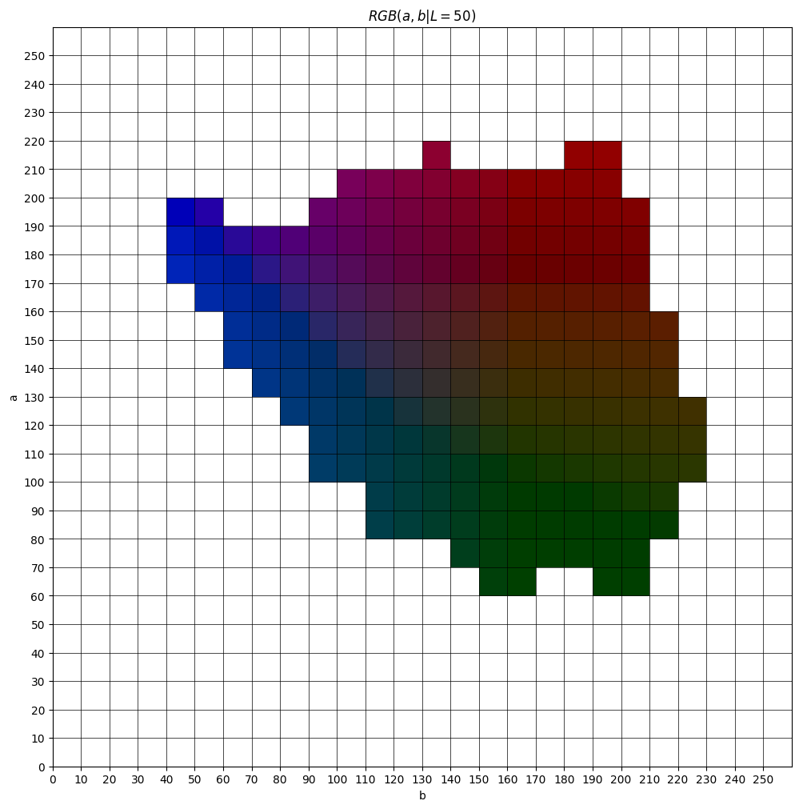

# Picture Colorizing

| **Zasób**                 | **Adres**                                                                                                                  |
| ------------------------- | -------------------------------------------------------------------------------------------------------------------------- |
| **Repozytorium projektu** | [github.com/jacekstrzalkowski/picturecolorizing](https://github.com/jacekstrzalkowski/picturecolorizing)                   |
| **Kaggle notebook**       | [kaggle.com/code/jacekstrzakowski/colorizing/](https://www.kaggle.com/code/jacekstrzakowski/colorizing/)                   |

Sztuczne kolorowanie obrazów jest rozumiane jako klasyfikacja obrazu w skali szarości $\mathbf{X} \in \mathbb{R}^{H\times W\times 1}$ do obrazu kolorowego $\mathbf{\tilde{X}}$: tablicy 2D $(H,W)$ trójek $(\mathbf{\tilde{X}_{R}}, \mathbf{\tilde{X}_{G}}, \mathbf{\tilde{X}_{B})}$, $\mathbf{\tilde{X}} \in \mathbb{R}^{H\times W\times 3}$.

Postępując podobnie jak w [@zhangColorfulImageColorization2016], przechodzimy z reprezentacji `RGB` obrazu do reprezentacji kolorów przestrzeni barw `LAB`. W przestrzeni LAB składowa jasności $L$ jest oddzielona od składowych: $a$ - barwy czerwono - zielone, $b$ - niebiesko żółte,
$$\mathbf{\tilde{X}}_{Lab} = \{L, \tilde{a}, \tilde{b}\}, \quad \mathbf{\tilde{X}}_{Lab} \in \mathbb{R}^{H \times W \times 3}.$$
Sieć neuronowa $M$ w działaniu na obraz $\mathbf{X}$ zwraca $\mathbf{\tilde{X}}_{Lab}$, który następnie jest poddawany odwrotnej transformacji z przestrzeni `Lab` do `RGB`. Zauważmy, że pozwala to ująć problem kolorowania obrazów jako klasyfikacji jedynie dwóch kanałów $(a,b)$, podczas gdy jasność pozostaje dostępna jako wejście.

## Usprawnienia

Wybrano $200$ kolorów `ab` - klas do klasyfikacji.

Zastosowano wieloklasową entropię krzyżową.

$$L_{cl}(\hat{Z}, Z) = -\sum_{h,w} v(Z_{h,w}) \sum_{q} Z_{h,w,q} \log(\hat{Z}_{h,w,q}),$$

gdzie $(h,w)$ - piksel, $$\hat{Z}_{h,w,q}$$ - wartość przewidywana, $$Z_{h,w,q}$$ - wartość uczona.

Wagi do zrebalansowania klas zostały wyznaczone następująco

$$
w_q = \frac{1}{\left((1 - \lambda) \cdot \tilde{p}_q + \lambda \cdot \frac{1}{Q}\right)}, \quad \text{where} \quad \tilde{p}_q = G_{\sigma} * p_q, \quad \text{and} \quad p_q = \frac{\text{count}_q}{\sum_{i=1}^Q \text{count}_i}
,$$

gdzie $\lambda = 0.5$ - czynnik "mieszający", $G_{\sigma}$ - jądro gaussowskie o promieniu $\sigma = 5$, $Q$ - ilość klas, $p_q$ prawdopodobieństwo klasy $q$. Przetestowano również inne wartości $\lambda$ i $\sigma$.

Mając wektor prawdopodobieństw $\hat{Z}_q = \text{softmax}(z_q)$ jako wynik działania sieci, możemy wyznaczyć przewidywane ubarwienie $a, b$,

$$
\hat{a} = \sum_q \hat{Z}_q \cdot a_q, \quad \hat{b} = \sum_q \hat{Z}_q \cdot b_q
.$$
